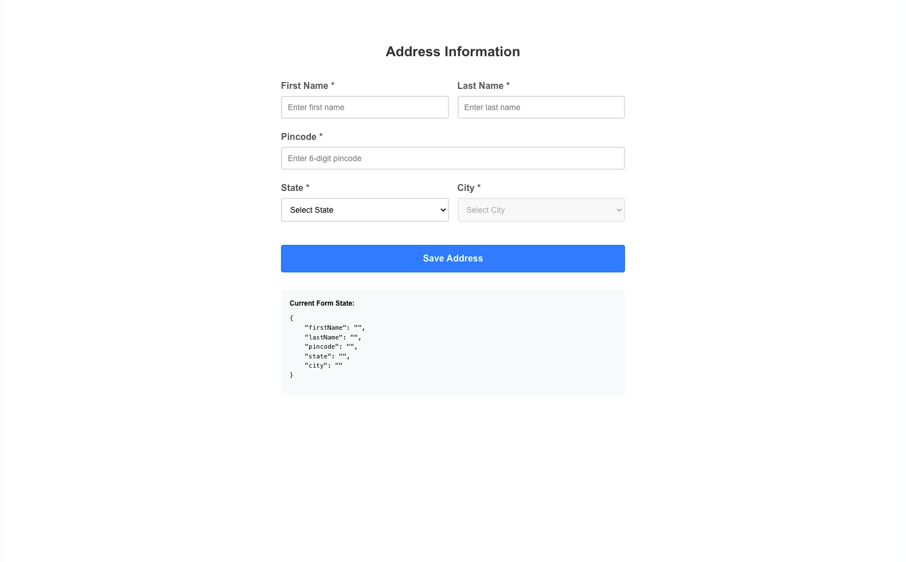

# UIPath SDE-2 Frontend Interview(Round 1) Experience 

### Interview Question
Build a React UI component where a user enters address details: first name, last name, pincode, state, and city. The UI should:
- Auto‑fill state and city from a pincode, and keep state/city/pincode in sync
- Validate inputs with clear error messaging
- Handle edge cases like invalid pincode or changing state after selecting a city

### Clarifications I Asked
- Can I use a small in‑memory dataset instead of an external API? Yes
- Are we focusing on UX details (focus management, inline errors)? Yes
- Scope for performance: reasonable for a demo; design for scalability

### My Implementation
- **Stack**: React 19 + TypeScript, Vite, ESLint
- **Structure**:
  - `components/Address.tsx`: form UI and interactions
  - `hooks/useAddressData.ts`: fast lookups for states/cities/pincodes
  - `utils/data.ts`: small in‑memory dataset
  - `utils/validations.ts`: form validation helpers
- **Key Decisions**:
  - Built lookup maps with `useMemo` to achieve O(1) reads for ids and pincode prefixes
  - Encapsulated all data access in a hook to keep the component lean and testable
  - Added subtle UX: clear field‑specific errors as the user types; move focus to city after state changes

### Walkthrough
- Enter a 6‑digit pincode → auto‑fills `state` and `city`. Invalid pincode shows an inline error.
- Change `state` → city resets and the dropdown lists only cities in that state; focus moves to city.
- Pick a `city` → back‑fills `state` (if needed) and its canonical `pincode`.
- Submit → validates names (letters/spaces, min 2), required fields, and 6‑digit pincode.

### Complexity & Data Model
- `useAddressData` builds maps for `stateById`, `cityById`, `citiesByState`, and a `pincode` prefix map.
- Lookups are O(1); derived lists (cities by state) are O(k) where k is number of cities in that state.

### How to Run
1. `npm install`
2. `npm run dev`
3. Open the local URL shown in the terminal

### Follow‑up Questions (Asked) & Answers
- Performance and scale?
  - Replace in‑memory data with an API and cache via React Query/SWR; paginate or virtualize large city lists; memoize derived data; keep O(1) lookups.
- API integration?
  - Move `LOCATION_DATA` behind a service; add loading/error states; debounce pincode lookups; retry with backoff; cache by pincode prefix.
- Validation & accessibility?
  - Add aria‑describedby for errors, keyboard navigation, proper labels; extend validation for international names; add form‑level error summary.
- Edge cases?
  - Non‑existent pincode, multiple cities per pincode, switching state after city chosen, partial inputs, trimming whitespace.
- Testing strategy?
  - Unit tests for `validations` and `useAddressData` maps; component tests for flows (pincode→state/city, state→city list, city→pincode sync).
- Trade‑offs?
  - Chose simplicity (in‑memory data, prefix match) to focus on UX and correctness; real apps need authoritative data and normalization.

### Next Steps
- Swap data layer with a real pincode API; add optimistic updates and caching
- Persist submissions; add reset and edit flows
- Expand dataset and handle many‑to‑one pincode→city mapping
- Add tests and improve accessibility coverage
